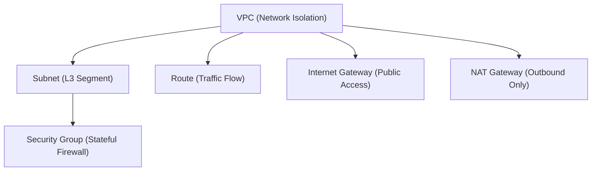

# API Documentation

The control plane provides a dual-interface architecture for managing the Cloud Networking Control Plane Simulator. For example, it allows users to use standard REST for intent declaration and high-performance gRPC for state inspection and telemetry.

## Interface Overview

| Interface | Default Port | Primary Purpose | Interactive Docs |
|-----------|--------------|-----------------|------------------|
| **REST**  | `8000`       | Intent Declaration (CRUD) | http://localhost:8000/redoc (ReDoc) |
|||| http://localhost:8000/docs (OpenAPI / Swagger)
| **gRPC**  | `50051`      | Performance & Telemetry | [cloud_networking_control_plane_simulator.proto](../control-plane/proto/cloud_networking_control_plane_simulator.proto) |

> [!NOTE]
> **Configurability**: Default ports are defined in `control-plane/main.py`. These can be overridden via environment variables `REST_PORT` and `GRPC_PORT` when starting the service.

## Resource Hierarchy

The simulator follows a standard cloud resource hierarchy:



---

## REST API (v1)

All endpoints return JSON responses. Use `Content-Type: application/json` for all `POST` requests.

### Identification & Deletion
> [!IMPORTANT]
> Resource IDs (e.g., `vpc-001`, `subnet-001`) are dynamically generated. Always perform a `GET` list operation to retrieve the correct ID before attempting a `DELETE` or specific `GET` request.

### 1. VPCs (Virtual Private Clouds)

**List VPCs**
```bash
curl -s -X GET http://localhost:8000/vpcs | jq
```

**Create VPC**
```bash
curl -s -X POST http://localhost:8000/vpcs \
  -H "Content-Type: application/json" \
  -d '{
    "name": "production-vpc",
    "cidr": "10.100.0.0/16",
    "region": "us-east-1"
  }'
```

**Get VPC**
```bash
curl -s -X GET http://localhost:8000/vpcs/vpc-001
```

**Delete VPC**
```bash
curl -s -X DELETE http://localhost:8000/vpcs/vpc-001
```

### 2. Subnets

**List Subnets in VPC**
```bash
curl -s -X GET http://localhost:8000/vpcs/vpc-001/subnets
```

**Create Subnet**
```bash
curl -s -X POST http://localhost:8000/vpcs/vpc-001/subnets \
  -H "Content-Type: application/json" \
  -d '{
    "name": "public-subnet-1a",
    "cidr": "10.100.1.0/24",
    "availability_zone": "us-east-1a"
  }'
```

**Delete Subnet**
```bash
curl -s -X DELETE http://localhost:8000/subnets/subnet-001
```

### 3. Routes

**List Routes in VPC**
```bash
curl -s -X GET http://localhost:8000/vpcs/vpc-001/routes
```

**Create Route**
```bash
curl -s -X POST http://localhost:8000/vpcs/vpc-001/routes \
  -H "Content-Type: application/json" \
  -d '{
    "destination": "0.0.0.0/0",
    "next_hop": "igw-001",
    "next_hop_type": "gateway"
  }'
```

**Delete Route**
```bash
curl -s -X DELETE http://localhost:8000/routes/rtb-001
```

### 4. Gateways

**Create Internet Gateway**
```bash
curl -s -X POST http://localhost:8000/vpcs/vpc-001/internet-gateways
```

**Create NAT Gateway**
```bash
curl -s -X POST http://localhost:8000/vpcs/vpc-001/nat-gateways \
  -H "Content-Type: application/json" \
  -d '{
    "subnet_id": "subnet-001"
  }'
```

### 5. Security Groups

**Create Security Group**
```bash
curl -s -X POST http://localhost:8000/security-groups \
  -H "Content-Type: application/json" \
  -d '{
    "name": "web-tier",
    "description": "Allow HTTP/HTTPS inbound",
    "rules": [
      {
        "direction": "ingress", 
        "protocol": "tcp", 
        "port_from": 80, 
        "port_to": 80, 
        "cidr": "0.0.0.0/0"
      },
      {
        "direction": "ingress", 
        "protocol": "tcp", 
        "port_from": 443, 
        "port_to": 443, 
        "cidr": "0.0.0.0/0"
      }
    ]
  }'
```

**Attach Security Group to Instance**
```bash
curl -s -X POST "http://localhost:8000/security-groups/sg-001/attach?instance_id=10.1.1.10"
```

---

## gRPC API

The gRPC interface provides high-performance access to the network state. The service definition is located at `control-plane/proto/cloud_networking_control_plane_simulator.proto`.

### Implementation Status

| Service Method | Type | Status | Note |
|----------------|------|--------|------|
| `ListVPCs` | Unary | **Implemented** | Optimized for bulk reads |
| `CreateVPC` | Unary | **Implemented** | Seamless background provisioning |
| `WatchNetworkEvents` | Stream | **Read-Only** | Real-time event subscription |
| `Full CRUD` | Unary | **Implemented** | Parity for Subnets, Routes, SGs, etc. |

### Example: List VPCs

**Request:** `ListVPCsRequest`
```json
{
  "limit": 100,
  "offset": 0
}
```

**Sample Usage (grpcurl):**
```bash
grpcurl -plaintext -d '{"limit": 10}' localhost:50051 network.NetworkService/ListVPCs
```

> [!TIP]
> Refer to the [cloud_networking_control_plane_simulator.proto](../control-plane/proto/cloud_networking_control_plane_simulator.proto) file for the full list of request/response messages and error codes.

---

## Error Handling

The API uses standard HTTP status codes for errors.

**Sample 404 Error (Resource Not Found):**
```json
{
  "detail": "VPC not found"
}
```

**Common Codes:**
- `200 OK`: Success (GET/LIST)
- `201 Created`: Success (POST)
- `400 Bad Request`: Validation failure
- `404 Not Found`: Resource ID does not exist
- `500 Internal Server Error`: Unexpected simulator failure

## Interactive Documentation

FastAPI automatically generates comprehensive interactive documentation. For a full list of schemas and to test endpoints within the browser, visit:

| UI | URL | Description |
|----|-----|-------------|
| **Swagger UI** | [http://localhost:8000/docs](http://localhost:8000/docs) | Interactive API explorer with "Try it out" functionality |
| **ReDoc** | [http://localhost:8000/redoc](http://localhost:8000/redoc) | Clean, readable API reference documentation |
